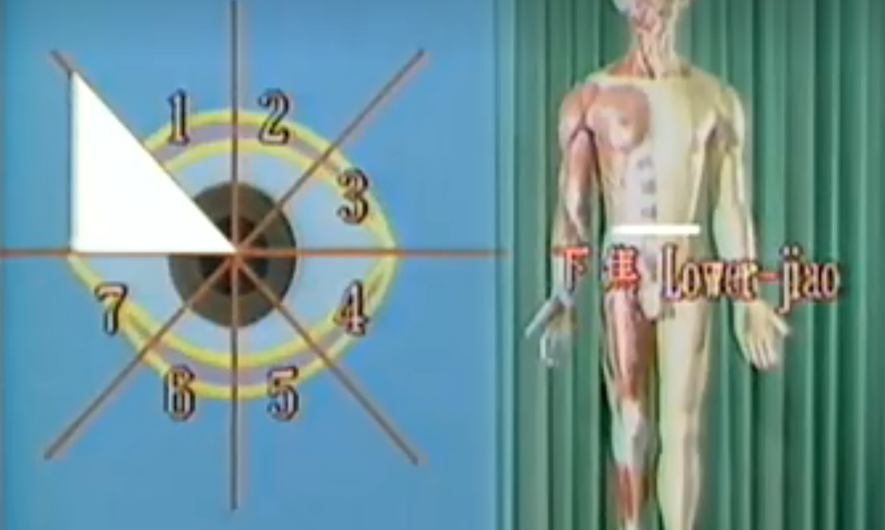
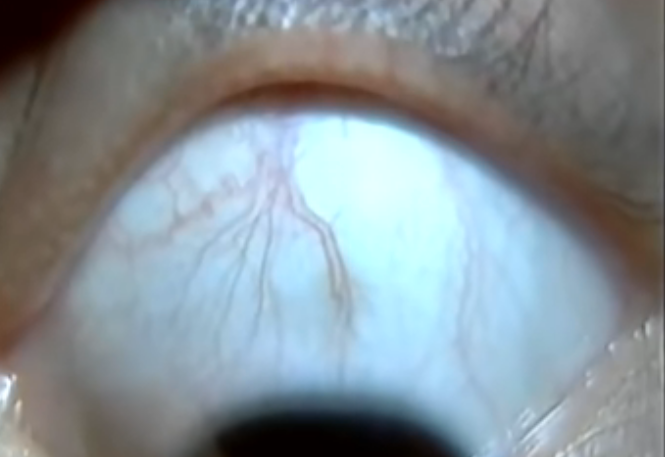

# 眼针

“諸脈皆屬于目”

“五臟六腑之精氣，皆上注于目而為精”

”肝氣同於目，肝和則目能辨五色“

”十二經脈，三百六十五絡，其血氣皆上注于木耳走空竅“

## 经络

涉及到眼睛的经络

### 足阳明胃经

### 足太阳膀胱经

### 手少阳三焦经

### 手少阳小肠经

### 足少阳胆经

### 足厥阴肝经

### 任脉

### 督脉

## 八卦

### 眼八周应八卦

### 眼周八区应脏腑

眼周八区十三穴

一二四六七；每区两个穴，一脏衣服

三五八；每区一个穴

1肺大肠、2肾膀胱、3上焦、4肝胆、5中焦、6心小肠、7脾胃、8下焦

### 分析例子

观眼知5区络脉清晰，红中带黑，中焦区热病入里

观眼5区和7区络脉明显鲜红，属于脾胃中焦新发病热实症状

观知7、8区络脉分叉多，鲜红，下焦和脾胃新发病，病势不稳，

## 辨病

正常：纤细；隐约；不明

### 络脉形态

#### 根部粗大

由白睛边缘处络脉粗大逐渐向前变细，属于顽固性疾病

#### 曲张

络脉出现曲张，由根部延申，中间转折曲张，属于病重

#### 延申

由某一经区传至某一经区

#### 分叉较多

常出现于眼球上部，下部有时出现，说明病势不稳定

#### 隆起一条

结膜络脉明显隆起，多属于六腑病变

#### 模糊一片

结膜络脉模糊不清，病多在肝胆区，属肝郁气滞

#### 垂露

白睛络脉下端像垂直一颗颗水珠，多见于胃肠区，属重饥，见于其他经区，多属郁症

### 络脉颜色

#### 鲜红

络脉颜色鲜红为新发病，属于实热，病势正在发展

#### 深红

多为热病，提示病势加重

#### 红中带黑

颜色深红，其中有黑色，属于热病入里

#### 红中带黄

红中带黄是病势减轻的现象

#### 络脉浅淡

络脉的颜色浅淡是气血不足的表现，属于虚证或寒证

#### 络脉暗灰

属于陈旧性病灶，症状痊愈，但络脉痕迹没有消失

## 针刺方法

常用15毫米，直径0.34毫米的针

进针深度约10mm，不可捻转，如未得气可以拔出再次插入

眼针留针时间5-15分钟

起针活动一下缓缓拔出二分之一再缓缓提出，用棉球压住止血，如继续出血需延迟按压，如淤血者可以用热毛巾热敷2-3天消退，

### 手法

#### 点刺法

闭眼按住眼睑，在穴位上点刺几次，以不出血为度

#### 沿皮横刺法

针尖刺入后，针体沿皮下刺入，达真皮不可再刺入

#### 双刺法

刺入一针后，可再针旁同向再刺一针以加强疗效

#### 表里合刺法

在同一穴区，框内框外各刺一针

#### 框内刺法

找准框缘，垂直刺入，贴向框缘

#### 缪刺法

当身体一侧患病，而针刺患侧无效时可以在对侧眼周同名穴位区针刺

#### 框内埋针法

对疗效不巩固的穴区刺入皮内针，以胶布埋藏固定留针一到两日

#### 压穴法

用火柴棒或三棱针顶在眼穴区按压治疗

#### 眼针同体针配合

眼部穴位同身体穴位相配合

#### 禁忌

震颤不止，躁动不安，眼睑肥厚者不用眼珍

## 取穴原则

### 循经取穴

诊断病症属于哪一区域或脏腑，即取对应穴区

如：肾虚腰痛则取第二区

### 看眼取穴

无论病属何区，看眼球络脉变化哪个穴区就区哪个穴区

### 病位取穴

划分上中下三焦

#### 膈肌以上者取上焦

#### 膈肌下腰上取中焦

#### 腰下取下焦

## 病例

### 中风偏瘫

症状：患者半身不遂，生活不能自理，脉弦细，患侧痉挛性瘫痪，手指不能屈伸，舌红少苔，眼肾区络脉粗大紫红，上下焦络脉鲜红色，针前上肢不能抬起，患侧下肢能微微抬起，健侧正常

治疗：按病位取穴，针刺双侧下焦和上焦区域

针后：再次检查患侧下肢抬高50cm，上肢也可明显抬高，针后5min可以下床缓慢步行

### 急性腰部扭伤

症状：腰痛剧烈，步行艰难，家属扶着，脉弦紧，舌无苔，眼下焦区络脉变粗鲜红色，急性病变

治疗：病位取穴，框内刺法，针刺双下焦区，令患者站立活动腰部

针后：腰部轻松疼痛缓解

### 胆石证

症状：胆绞痛，右侧腹部疼痛剧烈、脉弦紧，舌苔白，眼肝胆区络脉鲜红粗大向中焦区延申

治疗：针刺右侧肝胆区

针后：患者感到疼痛减轻逐渐缓解

### 落枕

症状：左侧颈部疼痛主动活动困难，被动活动疼痛加重，眼左侧肺大肠区和上焦区络脉鲜红为病变初期

治疗：针刺患侧上焦区

针后：颈部轻松疼痛缓解

### 高血压

症状：高压221mmhg低压125mmhg

治疗：针刺双侧肝胆区

针后：高压197mmhg低压112mmhg，心率减慢

### 牙疼

症状：右侧牙疼，脉沉紧，舌苔薄黄，眼见肺大肠区络脉深红有分叉

治疗：针刺右侧肺大肠区、上焦区

针后：牙痛缓解

### 胃痛

症状：脉沉细，眼见中焦和脾胃区，络脉怒张，颜色深红

治疗：按病位取双侧中焦区针刺

针后：胃痛无明显缓解

再治疗：撵针，刮针炳胃痛环节

