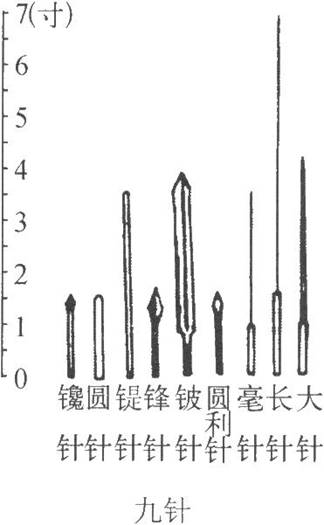

## 九针十二原第一
### 用针概要：
气机动，不离空穴，空穴的气机清静而微，其来不可逢（补），其往不可追（泻）。知其（正气）往来，掌握时机，往（去）者为逆，来者为顺。迎而夺之（逆气而刺，气刚来则堵），恶（wu怎么）得无虚（堵水），追而济之（随气而刺，气刚去即补），恶得无实（边倒水边加水），迎还是随，以意和之（好好想）。虚则实之，实则泻之，宛陈而除之，邪盛则虚之。
#### 补泻：
**实**：徐而疾（把气带入并按，补法）；
**虚**：疾而徐（把气拔出不按，泻法）；
补泻前要察后（后来）与先（先至），若存若亡（针的去留），让人感到为虚为实，若得若失（补之若有所得，泻之若有所失），补泻用针刺即可。实则泻其子，虚则补其母。
**泻**：必持内之（据时日扎入），放而出之（得气摇大针孔，拔出），排阳得针，邪气得泻。如按而引针，是谓内温，血不得散，气不得出。
**补**：随（随时，跟随正气，追而济之），随之意（所想）若妄之（随便扎），若行若按（行针导气，按穴下针），如蚊虻止（像他叮你一样轻而无感），如留（留针）如还（出针），去如弦绝（干脆迅疾），左手按右手出，气止于内，中气乃实。无淤血，有则马上除去。

#### 持刺之法：

坚（意志及针）者为宝，正指刺之，无针左右（别偏），神（聚精会神）察秋毫（眉目鼻头），属（专注）意病者，审视血脉者，刺之无殆（危险）。方刺之时，必经悬阳（体表阳气），及与两卫（两个外卫，肌肉为脏腑的外卫，循行于皮肤之中的卫气为体表的外卫），神属（专注）勿去，知病存亡，血脉的病，在腧横居，视之独澄（清楚），切之独坚。
#### 针刺注意
皮肉筋脉各有所处（部位），病各有所宜（孔穴），各不同形（情形），各以任其所宜，气在脉（经脉）也 ，邪气在上（外）针陷则邪气出，浊气在中（中）针中脉则浊气出，清气在下（内）针太深则邪气反沉。
不问虚实：不实不虚（不问），损不足而益有余，是谓甚病，取（乱取）五脉者死，取（乱取）三脉者恇（让人害怕），夺阴者死，夺阳者狂。
**侯气**：刺之而气不至，无问其数，刺之而气至，乃去，勿复针。针各不同，各有所长，气至而有效，效可靠，如风之吹云，明乎若见苍天。

#### 九针形及名：

**镵针**：一寸六分，头大末锐，去泻阳气。
**员针**：一寸六分，针如卵形，揩摩（按摩）分间（分开），不得伤肌肉，泻分气。
**鍉针**：三寸半，锋如黍粟之锐，主按脉勿陷，以致其气。
**锋针**：一寸六分，刃三隅，以发痼疾。
**铍针**：长四寸，广二分半，末如剑锋以取大脓。
**员利针**：一寸六分，大如氂，且员且锐，中身微大，以取暴气。
**毫针**：三寸六分，尖如蚊虻喙，静以徐往，微以久留而养，以取痛痹。
**长针**：七寸，锋利身薄，可取远痹。
**大针**：四寸，尖如梃，其锋微员，泻机关之水。

#### 五脏六腑经络：

五脏有五俞,五五二十五俞,六腑有六俞,六六三十六俞。
##### **经络**：

经脉十二,络脉十五，凡七十二气，以上下，
所出为井，（经气初出，如水流源头）
所溜为荥，（经气稍盛，如水成微流）
所注为俞，（经气渐盛，如水流灌注）
所行为经，（经气充盛，如大流长行）
所入为合，（经气丰盛，如大流汇海）
类比陆地溪流之发源，流行，汇合，入海。
二十七气所行，皆在五腧。（经脉气由小到大，由浅入深，起四肢末端）。

##### **节者**：

神气之所游行出入也，非皮肉筋骨也。节之交（类比自然节气.竹节等），三百六十五会，知其要者，一言而终，不知其要，流散无穷。
睹其色，查其目，知其散复；
一其形，听其动静，知其邪正。

##### 用针：

必先诊脉，视气之剧易，乃可治，右主推之，左持而御之，气至而去。
五脏之气已绝于内（闭塞于内），用针反实其外（类比海满注水），谓之重竭，重竭必死，其死也静，治之者，辄反其气，取腋于膺(腋与膺皆脏脉所出。气绝于内而复取之。则致气于外。而阴愈竭矣。)
五脏之气已绝于外（在外不入），而用针者反实其内（类比亡羊补牢），是谓逆厥，逆厥必死，其死也躁，治之者，反取四末。刺之害中而不去，则精泄；不中而去则致气，精泄则病益甚而恇（却若），致气则生而为痈疡。

##### 五脏：

十二原（以输代原）：五脏有六腑，六腑有十二原（五脏输穴和膏、肓的十二个原穴），十二原出于四关（十二经脉在腕、踝关节附近各有一个原穴，阴经的原穴即本经五输穴的输穴，阳经则于输穴之外另有原穴。），四关（四关原穴）主治五脏。十二原者，五脏之所以稟三百六十五节气味也。
治：五脏有疾，当取十二原。五脏有疾也，应出十二原。十二原各有所出。明知其原，睹其应，而知五脏之害矣。
**阳中之少阴，肺也，其原出于太渊，太渊二。**
**阳中之太阳，心也，其原出于大陵，大陵二。（心脏无腧穴，则取手厥阴心包经之大陵）**
**阴中之少阳，肝也，其原出于太冲，太冲二。**
**阴中之至阴，脾也，其原出于太白，太白二。**
**阴中之太阴，肾也，其原出于太溪，太溪二。**
**膏之原，出于鸠尾，鸠尾一。**
**肓之原，出于脖胦，脖胦一。**
凡此十二原者，主治五脏六腑之有疾者也。胀取三阳（三阳经(即胃、胆、膀胱)），飧泄（窜稀）取三阴（足三阴经(即脾、肝、肾)）。

##### 治则：

今夫五脏之有疾也，譬犹刺也，犹污也，犹结也，犹闭也。刺虽久犹可拔也，污虽久犹可雪也，结虽久犹可解也，闭虽久犹可决也。或言久疾之不可取者，非其说也。夫善用针者，取其疾也，犹拔刺也，犹雪污也，犹解结也，犹决闭也。疾虽久，犹可毕也。言不可治者，未得其术也。
刺诸热者，如以手探汤；刺寒清者，如人不欲行。阴有阳疾者，取之下陵三里，正往无殆，气下乃止，不下复始也。疾高而内者，取之阴之陵泉；疾高而外者，取之阳之陵泉也。